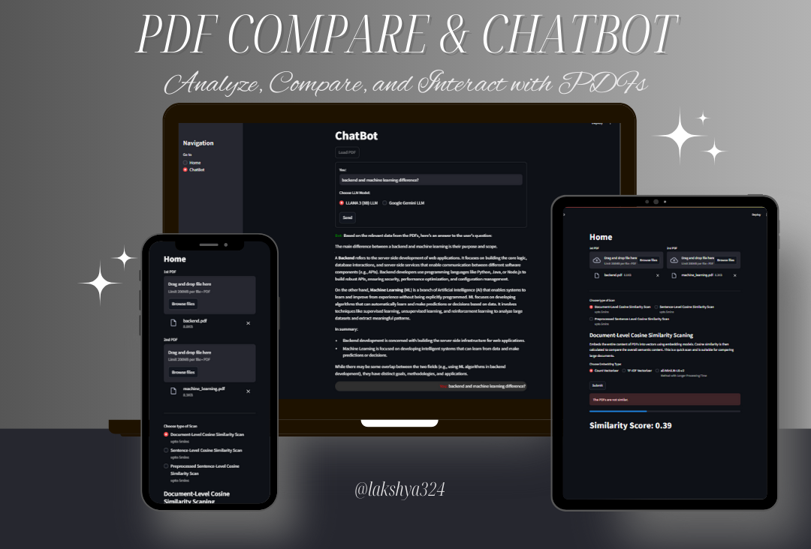

# PDF Comparison and ChatBot Application



This project provides a web application for comparing PDF documents using different cosine similarity scans and a chatbot interface to interact with the processed PDFs. The application is built using Streamlit, FastAPI, and LangChain.

## Features

- **PDF Comparison**: Compare two PDFs using different levels of cosine similarity scans.
  - Document-Level Cosine Similarity Scan
  - Sentence-Level Cosine Similarity Scan
  - Preprocessed Sentence-Level Cosine Similarity Scan
- **ChatBot**: Interact with the content of the PDFs using a chatbot powered by custom LLM models (LLAMA 3 and Google Gemini).

## Installation

1. **Clone the repository**:
    ```bash
    git clone https://github.com/lakshya324/pdf-compare-chatbot.git
    cd pdf-compare-chatbot
    ```

2. **Install the required packages**:
    ```bash
    pip install -r requirements.txt
    ```

3. **Set up environment variables**:
    Create a `.env` file in the root directory and add your environment variables:
    ```
    GOOGLE_API_KEY=your-google-api-key
    DEPLOYED=False
    ```

4. **Set up LLAMA 3 and OLLAMA**:
    Install LLAMA 3 (8B) and OLLAMA by running the following command:
    ```bash
    ollama run llama3
    ```

## Usage

1. **Run the Streamlit app**:
    ```bash
    streamlit run app.py
    ```

2. **Navigate to the Home Page**:
    - Upload two PDFs to compare.
    - Select the type of scan (Document-Level, Sentence-Level, Preprocessed Sentence-Level).
    - Choose the embedding type (Count Vectorizer, TF-IDF Vectorizer, all-MiniLM-L6-v2).
    - Click "Submit" to compare the PDFs and get the similarity score.

3. **Navigate to the ChatBot Page**:
    - Load the PDFs into the vector database.
    - Interact with the PDFs using the chatbot by selecting an LLM model and entering your query.

## Project Structure
```
├── app.py                     # Main Streamlit application
├── compare.py                 # PDF comparison logic
├── pdf_extractor.py           # PDF text extraction logic
├── text_preprocessing.py      # Pre-processing of PDF text
├── LLM
│   ├── gemini.py              # Google Gemini LLM integration
│   ├── llama3.py              # LLAMA 3 LLM integration (OLLAMA)
│   ├── prompt.py              # Prompt generation logic
├── embeddings
│   ├── CountVectorizer.py     # Count Vectorization logic
│   ├── TfidfVectorizer.py     # TF-IDF Vectorization logic
│   ├── all_MiniLM_L6_v2.py    # All-MiniLM-L6-v2 Vectorization logic
├── result.py                  # Chatbot result processing
├── requirements.txt           # Required Python packages
└── .env                       # Environment variables (not included in the repository)
```

## License

This project is licensed under the MIT License - see the [LICENSE](LICENSE) file for details.

## Acknowledgements

- [Streamlit](https://www.streamlit.io/)
- [Meta Llama 3](https://llama.meta.com/llama3/)
- [OLLAMA](https://ollama.com/)
- [Chroma Vector DB](https://www.trychroma.com/)
- [LangChain](https://www.langchain.com/)